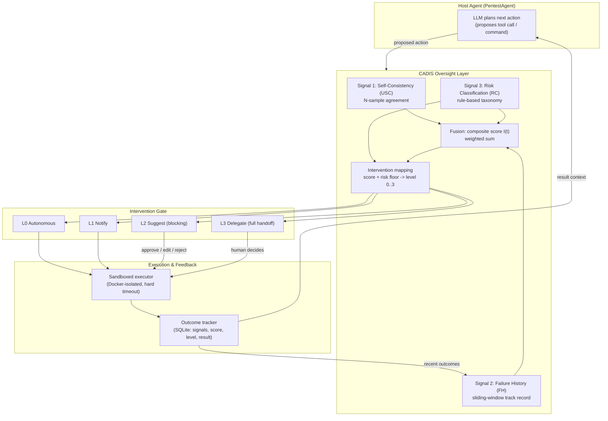
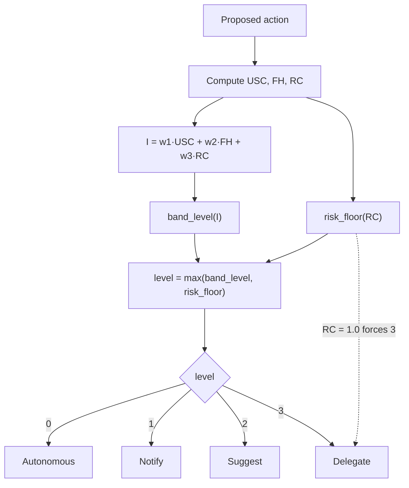

# CADIS — Confidence-Adaptive Dynamic Intervention System

> **Design & Architecture Document**
> Status: Living document · Scope: Conceptual / architectural · Audience: Developers & researchers
> This document describes an *intended modification* to PentestAgent. It is a design
> reference, not an implementation record. No source code is described here as existing
> unless explicitly marked **(implemented)**.

---

## Table of Contents

1. [Project Overview](#1-project-overview)
2. [Purpose of This Document](#2-purpose-of-this-document)
3. [Current Modification Goals](#3-current-modification-goals)
4. [High-Level Architecture](#4-high-level-architecture)
5. [Core Concepts](#5-core-concepts)
6. [Algorithms and Decision Logic](#6-algorithms-and-decision-logic)
7. [Research-Inspired Techniques](#7-research-inspired-techniques)
8. [Data Flow / Processing Pipeline](#8-data-flow--processing-pipeline)
9. [Evaluation & Benchmark Design](#9-evaluation--benchmark-design)
10. [Assumptions](#10-assumptions)
11. [Constraints](#11-constraints)
12. [Future Extension Ideas](#12-future-extension-ideas)
13. [Open Questions](#13-open-questions)
14. [Change Log (Documentation Only)](#14-change-log-documentation-only)

---

## 1. Project Overview

**CADIS (Confidence-Adaptive Dynamic Intervention System)** is a proposed *oversight and
routing layer* that sits between an LLM-driven pentesting agent and its execution
environment. For every action the agent proposes, CADIS estimates how much the agent
should be trusted *at that specific step* and routes the action to one of four graduated
intervention levels — from silent autonomous execution to a full human handoff.

CADIS is **not** a pentesting agent and does not generate offensive commands. It wraps the
existing **PentestAgent** framework (this repository) as the host that produces actions, and
adds a scoring-and-gating layer around it. The design deliberately treats the *agent*, the
*scorer*, and the *executor* as separable components.

The central thesis: an oversight policy that **scales with actual uncertainty and actual
consequence** outperforms both of the conventional extremes —

- **Full autonomy** (fast, but unmanaged cascade risk), and
- **Static human-in-the-loop / HITL** (safe, but defeats the point of automation),

*and* outperforms a **random intervention policy** spending the same amount of human
effort. The last comparison is the one that shows CADIS is stepping in at the *right*
moments, not merely at *some* rate.

### The problem CADIS targets

LLM agents used for offensive-security tasks in authorized lab environments (VulnHub,
HackTheBox, Metasploitable, DVWA) fail in a distinctive, compounding way:

- **Hallucination** — the model proposes a command, flag, CVE, or target path that does
  not exist or does not apply, stated with the same fluency and confidence as a correct one.
  There is no visible "I'm not sure" signal in the raw output.
- **Cascading failure** — because agent pipelines feed prior outputs back in as context for
  the next step, one hallucinated result poisons everything downstream. A wrong assumption
  about an open port or a wrong CVE match does not just fail once; subsequent steps get
  built on the false premise, burning time and — in a live engagement — risking disruptive
  actions taken with false confidence.

CADIS's job is not to make the agent smarter. It is to make the *system* recognize when the
agent probably should not be trusted, and to intervene in proportion to the real risk — the
way an experienced supervisor lets a junior operator run routine reconnaissance unwatched
but checks in before anything destructive, and watches more closely when recent work has
looked shaky.

---

## 2. Purpose of This Document

This document (`CadisClaude.md`) is the **conceptual design reference** for the CADIS
modification. It exists to:

- Capture the *current direction* of the project: what the modified system is meant to do
  and why.
- Record the **architecture, core concepts, algorithms, and decision logic** in a single
  maintainable place.
- Translate the research idea (originally captured in a project PDF) into an
  internally-consistent engineering design, generalizing or simplifying where that produces
  a cleaner system.
- Serve as an *evolving* engineering document — sections are expected to change as
  hyperparameters, signal definitions, and integration points are refined.

### Relationship to `CLAUDE.md`

`CLAUDE.md` documents the **existing PentestAgent framework as it is today** (tech stack,
repository layout, TUI/CLI/MCP surfaces, conventions). This document is **additive and
forward-looking**: it describes a layer to be built *on top of* that framework.

- `CLAUDE.md` → "what PentestAgent is."
- `CadisClaude.md` → "what the CADIS-modified PentestAgent is intended to become."

Where this document references PentestAgent internals (e.g. the agent loop, the tool
executor), those references describe **integration surfaces** — the seams CADIS would plug
into — not changes that have been made.

### What this document is *not*

- Not an implementation guide or code specification.
- Not a change to any source file.
- Not a claim that CADIS is built. Everything here is design intent.

---

## 3. Current Modification Goals

The modification introduces an oversight layer with these concrete goals:

| # | Goal | Success looks like |
|---|------|--------------------|
| G1 | **Per-action trust scoring** | Every proposed action receives a scalar intervention score in `[0, 1]` before it can execute. |
| G2 | **Graduated intervention** | The score routes to one of four levels (autonomous → notify → suggest → delegate), not a binary approve/reject. |
| G3 | **Hard safety floor** | Any action classified `CRITICAL` always escalates to full human delegation, regardless of confidence. |
| G4 | **Signal independence** | Three conceptually independent signals (epistemic uncertainty, performance history, consequence) are fused, so the decision uses more information than any single signal. |
| G5 | **Clean separability** | Agent, scorer, executor, and outcome tracker stay decoupled so the system is testable and the evaluation harness is possible. |
| G6 | **Tunable, inspectable config** | All weights and thresholds are exposed configuration, not hardcoded constants. |
| G7 | **Local, swappable backbone** | The scoring model runs against a local OpenAI-compatible endpoint so the self-consistency sampler is cheap and the LLM backbone is swappable. |
| G8 | **Falsifiable evaluation** | The system produces logged per-step signals + outcomes suitable for a rigorous benchmark against baseline policies. |

### Explicit non-goals

- CADIS does **not** implement offensive command generation or exploitation logic. That
  remains the responsibility of the host agent (PentestAgent, or a simplified equivalent).
- CADIS does **not** run against production or unauthorized systems. All execution is
  confined to isolated, authorized lab targets inside a network-isolated sandbox.
- CADIS does **not** attempt to make any single signal novel. The contribution is the
  *formalized fusion* into a graduated policy, plus its empirical evaluation.

---

## 4. High-Level Architecture

CADIS inserts a **decision gate** into the agent's action lifecycle. The host agent proposes;
CADIS scores and routes; a sandboxed executor carries out approved actions; an outcome
tracker feeds results back into the scoring layer for the next step.



### Component responsibilities

| Component | Responsibility | PentestAgent integration surface |
|-----------|----------------|----------------------------------|
| **Host agent** | Proposes the next action (tool call). Unmodified across all evaluation conditions. | `pentestagent/agents/base_agent.py` — the `_run_loop` produces `tool_calls` before `_execute_tools` runs. This boundary is the natural interception point. |
| **Signal modules** | Independent, individually testable components computing USC, FH, RC. | New conceptual modules; would consume the proposed action + recent outcome history. |
| **Fusion + mapping** | A small, pure-function core: composite score and threshold logic, derived directly from this document's formulas. | Pure functions with no I/O; the math here and the code must never drift apart. |
| **Intervention gate** | Enforces the chosen level: execute, notify, block-for-approval, or hand off. | Notifications map to `pentestagent/interface/notifier.py`; blocking maps to the existing "waiting for input" agent state. |
| **Sandboxed executor** | Runs approved commands in an isolated Docker network with a hard timeout. | `pentestagent/runtime/docker_runtime.py` + `pentestagent/tools/executor.py` (`ToolExecutor.execute`). |
| **Outcome tracker** | Logs every step (signals, score, level, action, result) to SQLite; serves the FH signal and the evaluation dataset. | New store; `ExecutionResult` from `ToolExecutor` already carries success/error/duration and is a ready-made outcome source. |
| **Local LLM serving** | Hosts the agent model, which doubles as the self-consistency sampler. | vLLM or Ollama behind an OpenAI-compatible endpoint; PentestAgent already supports `OPENAI_API_BASE` via `config/constants.py`. |

### Design principle: separability

The three most important boundaries in the system are:

1. **Agent ↔ CADIS** — CADIS observes proposed actions but does not author them.
2. **CADIS ↔ Executor** — CADIS decides *whether/how* an action runs; the executor decides
   *how it is isolated*.
3. **Executor ↔ Tracker** — outcomes are logged as data, then read back as the FH signal.

Keeping these seams clean is what makes the evaluation harness possible: metrics are
computed from **logged signal values and outcomes**, not re-derived after the fact.

---

## 5. Core Concepts

### 5.1 The three signals

CADIS fuses three signals, each answering a **different, largely independent question**:

| Signal | Symbol | Question it answers | Source of truth |
|--------|--------|---------------------|-----------------|
| Self-Consistency (uncertainty) | `USC` | *How unsure is the model about what to do right now?* | Model behavior (repeated sampling) |
| Failure History | `FH` | *Has this agent been getting things right lately?* | Recent execution outcomes |
| Risk Classification | `RC` | *If it's wrong here, how bad is that?* | The proposed action itself |

The independence argument is the crux of the whole design: because these three questions
are largely orthogonal, combining them yields more decision-relevant information than any
one alone. A model can be **fluently, token-by-token confident about a completely wrong
command** — so uncertainty alone is not enough. A model can **consistently agree with its
own wrong answer** — so self-consistency alone is not enough. A well-performing agent
would be **needlessly interrupted on every risky-looking category** — so risk alone is not
enough. All three, fused, is the point.

> **Why these three, and why fusion?** Each single-signal design is individually insufficient:
> token-level logprobs are often unavailable and don't track *semantic* uncertainty;
> self-consistency captures only epistemic uncertainty and costs N× inference; risk
> classification alone doesn't adapt to how the agent is actually performing. The formalized,
> weighted fusion into a *graduated* policy is the contribution — not any single mechanism.

### 5.2 Convention: everything is an "intervention-need" score

Every signal is normalized so that **higher means more oversight is needed**. This is why
self-consistency is *inverted* before fusion (`USC = 1 − SC`): a highly self-consistent model
needs *less* scrutiny, so its intervention-need contribution should be *low*.

- `USC ∈ [0, 1]`: `0` = model is consistent (no extra scrutiny needed); `1` = samples disagree.
- `FH ∈ [0, 1]`: `0` = clean recent track record; `1` = recent actions failing.
- `RC ∈ {0.0, 0.33, 0.66, 1.0}`: discrete consequence tiers, `1.0` = critical.

### 5.3 The four intervention levels

| Level | Name | Behavior | Blocking? |
|-------|------|----------|-----------|
| **0** | Autonomous | Execute immediately, no human involvement. | No |
| **1** | Notify | Execute, but notify a human (informational). | No |
| **2** | Suggest | Pause and wait for human approval, edit, or rejection. | Yes |
| **3** | Delegate | Full pause — hand the situation to a human entirely. | Yes |

### 5.4 The safety floor: consequence caps trust

A deliberate **asymmetry** governs the mapping:

- **Risk can push the level *up*.** A `CRITICAL` action (privilege escalation, lateral
  movement, data exfiltration, destructive operations) always triggers **Level 3**, no matter
  how confident and successful the agent has otherwise been.
- **Nothing can push the level *down*.** High confidence and a clean track record can never
  bypass the risk floor.

> **Consequence sets a ceiling on trust that confidence cannot buy back.**

---

## 6. Algorithms and Decision Logic

This section is the precise, checkable definition of the concepts in Section 5. The intent is
that the fusion/mapping code is a direct transcription of these formulas.

### 6.1 Signal 1 — Self-Consistency `SC` and Uncertainty `USC`

The agent is queried `N` times (default `N = 5`) against the **identical** context at a
non-zero temperature (default `T = 0.7`), producing sampled commands `cmd₁ … cmd_N`.
Pairwise agreement is averaged over all unordered pairs:

```
SC(t) = ( 2 / (N·(N−1)) ) · Σ_{i<j} sim(cmd_i, cmd_j)
```

The default similarity function is normalized edit distance:

```
sim(cmd_i, cmd_j) = 1.0                                             if cmd_i == cmd_j
sim(cmd_i, cmd_j) = 1 − ( edit_distance(cmd_i, cmd_j) / max_length ) otherwise
```

where `edit_distance` is the Levenshtein distance between the two command strings and
`max_length` is the length of the longer command, so `sim ∈ [0, 1]`.

- `SC(t) ∈ [0, 1]`: `1` = the model gave near-identical answers every time (high confidence);
  `0` = maximally divergent samples (high uncertainty).

Inverted for fusion:

```
USC(t) = 1 − SC(t)
```

> **Similarity is a pluggable strategy.** Edit distance treats two syntactically different but
> semantically equivalent commands as disagreement, which can *overstate* uncertainty
> (Section 11). The design therefore treats `sim(·,·)` as a swappable component: normalized
> edit distance by default, with embedding-based semantic similarity as a documented
> alternative for ablation. Either outcome (edit distance sufficing, or embeddings mattering)
> is a reportable result.

### 6.2 Signal 2 — Failure History `FH`

A sliding window of the last `K` execution outcomes is maintained (default `K = 10`). Each
outcome `O_k ∈ {success, partial, timeout, failure}` carries a severity weight:

| Outcome | Weight |
|---------|--------|
| `success` | 0.0 |
| `partial` | 0.3 |
| `timeout` | 0.5 |
| `failure` | 1.0 |

The failure-history score is the mean weight over the window of the `K` most recent prior
outcomes:

```
FH(t) = (1/K) · Σ_{k=t−K}^{t−1} weight(O_k)
```

- `FH(t) ∈ [0, 1]`: `0` = every recent action succeeded (track record supports trust);
  `1` = every recent action failed (track record argues for closer oversight, independent of
  how confident the model sounds on the next step).

> **Mapping outcomes onto the four categories.** `ExecutionResult` already distinguishes
> success/failure and captures timeouts and durations. The `partial` category is a judgment
> the outcome tracker assigns (e.g. a command that ran but produced no useful result). The
> exact classification rule is a tunable part of the tracker, documented alongside the
> hallucination-cascade definition (Section 9).

### 6.3 Signal 3 — Risk Classification `RC`

Every proposed command is mapped, via a **rule-based taxonomy** (regex rules per risk tier,
reviewed against MITRE ATT&CK categories), to one of four discrete risk levels:

```
RC(command) ∈ { 0.0, 0.33, 0.66, 1.0 }
```

| Score | Tier | Examples |
|-------|------|----------|
| 0.0 | LOW | Read-only enumeration, passive scanning, status checks |
| 0.33 | MEDIUM | Active scanning with potential service disruption, credential enumeration |
| 0.66 | HIGH | Exploitation attempts, payload delivery, configuration modification |
| 1.0 | CRITICAL | Privilege escalation, lateral movement, data exfiltration, destructive operations |

Unlike `USC` and `FH`, `RC` is **not derived from model behavior**. It is a property of the
proposed action itself, independent of how the agent arrived at it. That is exactly what lets
it act as a **hard override** (Section 6.5) rather than just another weighted input.

**Fail-safe behavior.** A rule-based taxonomy will not match every possible command.
Rather than silently trusting misses, the system **fails safe**: any unmatched command
defaults to **HIGH** risk and is **logged as a taxonomy gap** for expert review. Taxonomy
gaps become a concrete, reviewable worklist instead of an invisible weak point. An
LLM-assisted classification fallback may be used for misses, but every fallback case is logged
as a gap rather than silently accepted.

### 6.4 Composite Intervention Score `I(t)`

The three per-signal scores are combined into a single scalar via a weighted sum:

```
I(t) = w1·USC(t) + w2·FH(t) + w3·RC(t)

subject to:  w1 + w2 + w3 = 1,  w_i > 0
```

Initial (pre-ablation) weight recommendation:

| Weight | Value | Governs |
|--------|-------|---------|
| `w1` | 0.35 | Self-consistency / epistemic uncertainty |
| `w2` | 0.30 | Failure history / performance trajectory |
| `w3` | 0.35 | Risk classification / consequence severity |

`I(t) ∈ [0, 1]` by construction. It is the formal expression of the independence argument: a
linear combination of three signals answering three different questions.

> **Weights are hyperparameters, not conclusions.** The `0.35 / 0.30 / 0.35` split and the
> thresholds below are *starting points* subject to empirical sensitivity testing, not values
> asserted correct by construction. See Section 9 for the ablation protocol that re-scores
> cached signal logs under alternative weights without re-running the agent.

### 6.5 Intervention Level Mapping

The mapping combines two independent computations and takes the **more conservative**
(higher) of the two. This document adopts a **`max()` formulation** as the canonical
statement of the mapping, because it is internally cleaner than overlapping `OR` clauses and
reproduces every case exactly — including the hard `CRITICAL` floor and the "risk pulls the
level up" behavior.

**Step 1 — band level from the composite score** (default thresholds
`τ0, τ1, τ2 = 0.25, 0.50, 0.75`):

```
band_level(I) = 0   if I < τ0
              = 1   if τ0 ≤ I < τ1
              = 2   if τ1 ≤ I < τ2
              = 3   if I ≥ τ2
```

**Step 2 — risk-floor level from the risk tier alone**:

```
risk_floor(RC) = 0   if RC = 0.00   (LOW)
               = 1   if RC = 0.33   (MEDIUM)
               = 2   if RC = 0.66   (HIGH)
               = 3   if RC = 1.00   (CRITICAL, hard)
```

**Step 3 — final level**:

```
level(t) = max( band_level(I(t)), risk_floor(RC(t)) )
```



**Why `max()` is faithful to the original design:**

- The **hard `CRITICAL` floor** is automatic: `RC = 1.0 ⇒ risk_floor = 3 ⇒ level = 3`,
  regardless of `I(t)`.
- **Risk can only raise the level, never lower it** — `max()` cannot return a value below
  `band_level`, so a clean score can never *drop* below the risk floor, and a high risk floor
  can *raise* a low-score action. This is precisely the "consequence caps trust" asymmetry.
- The original `Level 0` condition ("`I < τ0` **AND** `RC < 0.66`") plus the `Level 1` clause
  ("**OR** `RC = 0.33`") collapse cleanly: `RC = 0.33 ⇒ risk_floor = 1`, so a
  medium-risk action can never be `Level 0` even with a tiny score. `max()` captures this
  without special cases.

### 6.6 Worked example

At step `t`:

- Self-consistency across `N = 5` calls yields `SC = 0.60` → `USC = 0.40`.
- The last `K = 10` outcomes contain 2 failures and 1 timeout →
  `FH = (2·1.0 + 1·0.5 + 7·0.0) / 10 = 0.25`.
- The proposed command is classified **HIGH** → `RC = 0.66`.

Composite score, default weights:

```
I(t) = 0.35·(0.40) + 0.30·(0.25) + 0.35·(0.66)
     = 0.140 + 0.075 + 0.231
     = 0.446
```

Mapping:

- `band_level(0.446) = 1`  (since `0.25 ≤ 0.446 < 0.50`)
- `risk_floor(0.66) = 2`   (HIGH)
- `level = max(1, 2) = 2`  → **Level 2 (Suggest)**

The composite score alone would suggest a lighter touch (Notify), but the **HIGH risk tier
pulls the intervention level up** to a blocking approval. The action pauses for human
approval, edit, or rejection rather than merely notifying. This is exactly why consequence is
allowed to override the score upward.

### 6.7 Pure-function core (design contract)

The fusion and mapping logic is specified to be a set of **pure functions** — no I/O, no
hidden state, deterministic given inputs:

```
compute_composite(usc, fh, rc, weights)          -> I            in [0, 1]
band_level(I, thresholds)                         -> {0,1,2,3}
risk_floor(rc)                                    -> {0,1,2,3}
map_to_level(I, rc, thresholds)                   -> {0,1,2,3}    (the max() rule)
```

This is a maintainability contract: because these are pure and side-effect-free, cached signal
logs can be **re-scored offline** under any weight/threshold combination for the ablation
study (Section 9), and the math in this document can be unit-tested against the code
one-to-one.

---

## 7. Research-Inspired Techniques

CADIS draws on three established research literatures and combines them in a way that (per
the survey literature grounding this project) has not previously been formalized for
LLM-driven pentesting agents.

| Technique | Origin literature | Role in CADIS |
|-----------|-------------------|---------------|
| **Self-consistency / sampling agreement** | LLM uncertainty estimation | Signal 1 (`USC`): repeated sampling as an epistemic-uncertainty proxy. |
| **Risk-tiered gating with a hard floor** | Safe reinforcement learning; safety-critical control | Signal 3 (`RC`) + the `CRITICAL` override: consequence caps autonomy. |
| **Adaptive autonomy / graduated intervention** | Adaptive-autonomy robotics; human-supervisory control | The four-level policy: oversight scales with uncertainty and consequence. |
| **Performance-history conditioning** | Trust-in-automation / operator-supervision models | Signal 2 (`FH`): recent track record modulates latitude. |
| **Calibration measurement (ECE)** | Probability calibration | Validates that `I(t)` *means* what it claims (Section 9). |

### The genuine gap

The individual mechanisms already exist elsewhere. What does **not** exist — confirmed
against the survey literature — is a **formalized, scored fusion of these three signals into a
graduated intervention policy specifically for LLM pentesting agents**, with defined
thresholds, weights, and an evaluation protocol. Prior security-agent work uses layered
techniques (chain-of-thought prompting, hints, retrieval-augmented context, prompt-tuning)
as *ad hoc* design choices; nothing formalizes them into a reproducible scoring system.
**That formalization is the contribution — not any single mechanism.**

### Techniques carried over from the source concept, with refinements

This document intentionally generalizes a few points from the originating research write-up
to make the design more internally consistent and maintainable:

1. **Similarity as a strategy interface** (Section 6.1) — the source treats embedding
   similarity as an ablation; here it is elevated to a first-class swappable strategy behind a
   stable `sim(·,·)` contract.
2. **`max()` mapping** (Section 6.5) — the source expresses the mapping as overlapping `OR`
   clauses plus a separate hard floor. This document consolidates them into a single `max()`
   of a band level and a risk-floor level, which is provably equivalent for the stated cases
   and easier to reason about and test.
3. **Signal provider abstraction** (Section 12) — the three signals are framed as instances of
   a general "intervention-need signal" so additional signals (e.g. token logprobs where
   available) can be added later without disturbing the fusion core.

None of these change the system's behavior on the documented cases; they make the design
easier to extend and verify.

---

## 8. Data Flow / Processing Pipeline

### 8.1 Per-action lifecycle

```mermaid
sequenceDiagram
    participant Agent as Host Agent (PentestAgent)
    participant CADIS as CADIS Scorer
    participant Human as Human Supervisor
    participant Sandbox as Docker Sandbox
    participant Tracker as Outcome Tracker (SQLite)

    Agent->>CADIS: proposed action (tool call / command)
    Note over CADIS: Signal 1 — sample agent N times<br/>at T=0.7, compute USC
    CADIS->>Tracker: read last K outcomes
    Tracker-->>CADIS: recent outcomes
    Note over CADIS: Signal 2 — compute FH<br/>Signal 3 — classify RC
    Note over CADIS: Fuse -> I(t); map -> level
    alt level 0 (Autonomous)
        CADIS->>Sandbox: execute
    else level 1 (Notify)
        CADIS->>Human: notify (non-blocking)
        CADIS->>Sandbox: execute
    else level 2 (Suggest)
        CADIS->>Human: request approval / edit / reject
        Human-->>CADIS: decision
        CADIS->>Sandbox: execute approved action
    else level 3 (Delegate)
        CADIS->>Human: full handoff
        Human-->>Sandbox: human-driven action
    end
    Sandbox-->>Tracker: outcome (success/partial/timeout/failure)
    Tracker-->>Agent: result context for next step
    Note over Tracker: log signals, I(t), level,<br/>action, outcome (one row)
```

### 8.2 What gets logged per step

The outcome tracker records **one row per proposed action**, forming both the FH data
source and the evaluation dataset:

```
step_id, timestamp, target,
proposed_action,
usc, fh, rc,
weights (w1, w2, w3), thresholds (τ0, τ1, τ2),
composite_score I(t),
band_level, risk_floor, final_level,
human_decision (if any),
outcome_category {success | partial | timeout | failure},
duration_ms, error (if any)
```

Because signal values are logged *as computed*, the ablation study can re-derive
`I(t)` / `final_level` under alternative `(w, τ)` grids **without re-running the agent or the
sandbox** — the load-bearing property that makes a real grid search feasible on a project
timeline.

### 8.3 Integration path within PentestAgent (design intent)

The interception point is the seam in the agent loop between *action proposal* and *action
execution*:

```
base_agent._run_loop()
  └─ LLM.generate(...)                      # agent proposes response.tool_calls
      └─ [CADIS GATE]  <-- inserted here    # score + route each proposed tool call
          ├─ level 0/1  -> _execute_tools() # existing execution path
          ├─ level 2     -> block on human approval, then _execute_tools()
          └─ level 3     -> hand off to human; agent enters WAITING_INPUT state
      └─ _execute_tools()                   # ToolExecutor.execute -> DockerRuntime
          └─ ExecutionResult                # feeds the Outcome Tracker
```

- **Notification** for Level 1 reuses `interface/notifier.py` (`notify(level, message)`).
- **Blocking** for Levels 2–3 reuses the existing `WAITING_INPUT` agent state.
- **Execution + isolation** reuse `ToolExecutor.execute` and `DockerRuntime` (hard timeout
  already enforced via `asyncio.wait_for`).
- **Outcome capture** reuses `ExecutionResult` (success/error/duration already present).

> These are *integration surfaces*, described so the design is concrete. This document does
> not modify any of these files.

---

## 9. Evaluation & Benchmark Design

The framework's central claims are **empirical**: that intelligent, adaptive intervention
beats full autonomy, beats static HITL, and beats random intervention at the same
human-effort cost. A design that only exists as a diagram is not falsifiable — the
implementation and its benchmark are what make the hypothesis testable.

### 9.1 The four benchmark conditions

All four run against the **same** targets with the host framework **completely unmodified
and identical** across conditions — CADIS is the only variable that changes.

| Condition | Description | What it isolates |
|-----------|-------------|------------------|
| **Full Autonomy** | No intervention layer; every generated command executes immediately. | Upper bound on speed; baseline failure/cascade rate with zero oversight. |
| **Static HITL** | Every command requires human approval regardless of content. | Upper bound on safety; the cost of maximal oversight. |
| **Random Intervention** | Commands intervened on at a rate **matched to CADIS's measured human-effort ratio**, but chosen at random. | **The critical control** — whether CADIS's decisions are *well-placed*, or whether any intervention at the same rate would do as well. |
| **CADIS** | The full system: USC + FH + RC fused, routed to four levels. | The system under test. |

> **The random-intervention baseline is load-bearing.** Beating full autonomy could just
> mean "any intervention helps." Beating static HITL could just mean "less intervention is
> faster." Only beating a *random policy that intervenes exactly as often as CADIS* shows that
> the composite score points at the **right moments** — that intelligent threshold selection,
> not intervention volume, is doing the work.

### 9.2 Metrics

**Primary** (do outcomes improve?):

- **Task Completion Rate (TCR)** — proportion of atomic subtasks (e.g. exploit a given CVE,
  achieve privilege escalation on a target) completed successfully within a run.
- **Hallucination-Cascade Rate (HCR)** — proportion of runs that hit a **pre-registered**
  cascade condition (a run of consecutive failures attributable to invalid commands or
  nonexistent targets, *not* to environmental issues like auth or network failures).
- **Human Effort Ratio (HER)** — proportion of total agent actions requiring any human
  involvement. Lower is better **only when TCR is held constant or improved** — a low HER
  with a low TCR just means the system failed autonomously instead of under supervision.

**Secondary** (support & qualify the primary results):

- **Intervention Appropriateness Score (IAS)** — independent human reviewers rate each
  intervention decision as *appropriate*, *should-have-intervened*, or *unnecessary*. The
  qualitative check on whether the score points at the right *moments*, not just the right
  frequency.
- **Time-to-Completion (TTC)** — wall-clock time per task, so the latency cost of adaptive
  oversight is visible alongside the benefit.
- **Expected Calibration Error (ECE)** — CADIS condition only (the only one with a
  comparable confidence score). Measures how well `I(t)` predicts failure, by comparing
  predicted failure probability against observed failure rate across score bins.

> **Calibration is evaluated separately from task performance** because a system can look
> good on outcomes while being poorly calibrated (getting lucky, or the risk term dominating
> in a way that correlates with failure without the composite score actually predicting it).
> ECE checks whether `I(t)` *means* what it claims.

### 9.3 Protocol (summary)

1. **Freeze the environment** — pin host-framework commit, local model weights (by
   revision/checksum), GPU/driver versions, and every CADIS config value.
2. **Pre-register the cascade definition** — write the exact operational rule *before* any run;
   changing it later is disclosed as a deviation.
3. **Fix the target set** — small, fixed, difficulty-spanning (DVWA/Metasploitable for early
   validation; broader VulnHub/HackTheBox for the full benchmark). Identical across
   conditions.
4. **Run all conditions × targets, with repetition** — ≥ 3 repetitions per (condition × target)
   pair, different seeds. For Random Intervention, run CADIS on the target *first* so its
   measured HER is known and matched.
5. **Collect IAS ratings** — two independent, blind raters per decision; report inter-rater
   agreement (target κ ≥ 0.7); document reconciliation.
6. **Compute metrics per run, then aggregate by condition** (mean + variance / CI, per target
   and pooled).
7. **Statistical comparison** — paired / repeated-measures test (same targets under every
   condition), with **both significance and effect size**.
8. **Ablation** — re-score recorded signal logs under a grid of `(w, τ)` combinations, no
   re-running of sessions.
9. **Report calibration** — ECE + reliability diagram for the CADIS condition.
10. **Archive everything** — raw per-run data, aggregates, IAS ratings, ablation, calibration,
    plus a `RUNLOG` of deviations.

### 9.4 Suggested on-disk layout (documentation only)

```
benchmark/
├── config/
│   ├── frozen_environment.yaml        # pinned model, host commit, CADIS config
│   └── hallucination_cascade_def.md   # pre-registered definition
├── targets/
│   └── target_manifest.md             # fixed target set + difficulty notes
├── raw_runs/
│   ├── full_autonomy/  target_XX/ rep_YY/
│   ├── static_hitl/    ...
│   ├── random_intervention/ ...
│   └── cadis/          ...
├── ias_review/
│   ├── export_for_review/             # decisions, blind to condition
│   ├── rater_1_completed.csv
│   ├── rater_2_completed.csv
│   └── inter_rater_agreement.md
├── ablation/
│   └── weight_threshold_grid_results/
├── results/
│   ├── metrics_per_run.csv
│   ├── metrics_by_condition_summary.csv
│   ├── statistical_comparisons.md
│   ├── calibration/reliability_diagram.png
│   └── figures/
└── RUNLOG.md                          # deviations, with dates and reasons
```

---

## 10. Assumptions

- **A1 — Authorized lab targets only.** All execution occurs against isolated, authorized lab
  environments (VulnHub / HackTheBox / Metasploitable / DVWA style) with explicit written
  authorization. No route exists to anything beyond the intended target.
- **A2 — The host agent is a black box.** CADIS observes proposed actions and outcomes; it
  does not depend on the agent's internal reasoning. The agent (PentestGPT-style pipeline or
  PentestAgent) is treated as an existing, separately-scoped component.
- **A3 — Repeated sampling is affordable.** A local, self-hosted, OpenAI-compatible model
  makes `N` samples per action essentially free beyond one-time hardware cost, which a
  hosted API would not.
- **A4 — Outcomes are classifiable.** Each execution can be labeled `success / partial /
  timeout / failure` reliably enough to feed the FH signal.
- **A5 — Proposed actions are inspectable as strings.** The USC similarity function and the
  RC taxonomy operate on the command/tool-call text.
- **A6 — Signals are (approximately) independent.** The fusion's value rests on USC, FH, and
  RC answering largely orthogonal questions. Strong correlation among them would weaken
  (though not invalidate) the design; this is itself measurable.
- **A7 — Weights/thresholds require tuning.** The default `(0.35, 0.30, 0.35)` and
  `(0.25, 0.50, 0.75)` are starting points to be validated by ablation, not settled values.

---

## 11. Constraints

- **C1 — No offensive logic in CADIS.** The oversight layer never generates exploitation
  commands; that stays in the host agent.
- **C2 — Network-isolated execution.** Commands run inside an isolated Docker network with
  a hard timeout, never on the host.
- **C3 — Interpretable risk classification.** Risk classification is rule-based by default
  (regex per tier, reviewed against MITRE ATT&CK), chosen over a black-box classifier for
  interpretability and reproducibility. An LLM-assisted fallback is allowed only for taxonomy
  misses, and every fallback is logged as a gap.
- **C4 — Fail safe on unknowns.** Unmatched commands default to **HIGH** risk and are
  logged for expert review.
- **C5 — Self-consistency's blind spot.** Edit-distance similarity can treat semantically
  equivalent-but-syntactically-different commands as disagreement, overstating uncertainty.
  Known and bounded; mitigated by the swappable similarity strategy (Section 6.1).
- **C6 — Sampling cost.** `N = 5` sampling is the single largest cost/latency driver. Reducing
  `N` (justified by SC-estimate variance as a function of `N`) or restricting sampling to stage
  transitions rather than every command are principled scope levers, to be applied
  explicitly rather than silently.
- **C7 — Benchmark validity precondition.** The host framework must run **identically** across
  all four benchmark conditions. If it does not, no benchmark result is interpretable.
- **C8 — Config-only tuning.** Weights, thresholds, `N`, `K`, and the risk taxonomy must be
  exposed configuration, never hardcoded, so ablation and reproducibility are possible.
- **C9 — Documentation boundary.** This document must not modify source code or overwrite
  `CLAUDE.md`; it is a design reference only.

---

## 12. Future Extension Ideas

> These are **documented possibilities**, not committed work.

- **F1 — Signal provider abstraction.** Formalize a general `InterventionSignal` interface
  (`name`, `compute(context) -> [0,1]`, `weight`) so USC/FH/RC become instances and new
  signals can be added without touching the fusion core.
- **F2 — Token-level uncertainty signal.** Where the local backbone exposes reliable
  logprobs, add a token-entropy signal as an additional provider — complementary to, not a
  replacement for, self-consistency.
- **F3 — Embedding-based command similarity.** Promote semantic similarity from ablation to
  a selectable default for `sim(·,·)` if the benchmark shows it materially reduces spurious
  uncertainty.
- **F4 — Learned / non-linear fusion.** Explore replacing the linear weighted sum with a
  monotonic learned combiner, *if* interpretability and the calibration story can be preserved.
- **F5 — Adaptive thresholds.** Let `(τ0, τ1, τ2)` adapt per target or per pentest phase
  (recon vs. exploitation) instead of being global constants.
- **F6 — Crew-mode integration.** Extend CADIS from the single-agent loop to multi-agent
  (`crew`) mode, scoring orchestrator delegations and worker actions, with the ShadowGraph
  as additional context for the risk signal.
- **F7 — Human-decision learning loop.** Feed Level 2 human edits/rejections back as labeled
  data to refine the risk taxonomy and calibrate thresholds over time.
- **F8 — Richer outcome taxonomy.** Expand beyond four outcome categories (e.g. distinguish
  "environmental failure" from "invalid-command failure") to sharpen the FH signal and the
  cascade definition.
- **F9 — Real-time calibration dashboard.** Surface live `I(t)` vs. observed-failure reliability
  in the TUI so an operator can see whether the score is currently trustworthy.

---

## 13. Open Questions

- **Q1 — Outcome labeling fidelity.** What is the precise, reproducible rule for `partial` vs.
  `failure` vs. `timeout`, and how sensitive is FH to that boundary?
- **Q2 — Cascade definition.** What minimum run length of consecutive invalid-command /
  nonexistent-target failures defines a hallucination cascade, and how is it distinguished from
  environmental failure at logging time? (Must be pre-registered — Section 9.)
- **Q3 — Signal independence in practice.** How correlated are USC, FH, and RC on real runs,
  and does observed correlation undermine the fusion rationale?
- **Q4 — Optimal `N`.** How does the variance of the SC estimate fall with `N`, and where is
  the knee that justifies a smaller `N` for cost?
- **Q5 — Similarity metric adequacy.** Does edit-distance similarity overstate uncertainty
  enough to change intervention decisions, or is it sufficient in practice?
- **Q6 — Weight sensitivity.** How stable is the headline benchmark result across the
  `(w, τ)` ablation grid? Is there a broad plateau, or a sharp optimum?
- **Q7 — Calibration vs. performance.** If `I(t)` is well-calibrated but task performance is
  flat, or vice versa, how is that reconciled in the conclusions?
- **Q8 — Human-in-the-loop latency.** How much of the TTC cost is model sampling vs. human
  wait time, and does that change the practical value of Levels 2–3?
- **Q9 — Sampling scope.** Is per-command sampling necessary, or does sampling only at
  stage transitions retain most of the benefit at a fraction of the cost?
- **Q10 — Backbone generalization.** How much do results shift when the local LLM backbone
  is swapped (the external-validity concern the local-serving choice is meant to address)?

---

## 14. Change Log (Documentation Only)

> Tracks changes to **this document**, not to any code.

| Date | Version | Change |
|------|---------|--------|
| 2026-08-06 | 0.1.0 | Initial draft. Established CADIS design: three-signal fusion (USC / FH / RC), composite score `I(t)`, four-level intervention policy, hard `CRITICAL` floor, and evaluation/benchmark design. Grounded the architecture in PentestAgent integration surfaces (`base_agent._run_loop`, `ToolExecutor`, `DockerRuntime`, `notifier`). Consolidated the intervention mapping into a canonical `max(band_level, risk_floor)` formulation. Elevated command similarity to a swappable strategy and introduced the signal-provider abstraction as a future extension. |

---

### Document conventions

- **(implemented)** marks anything that exists in code today. Absent that tag, content is
  design intent.
- Formulas are the source of truth for the fusion/mapping core; code is expected to
  transcribe them directly.
- This document is additive to `CLAUDE.md` and never supersedes it.
